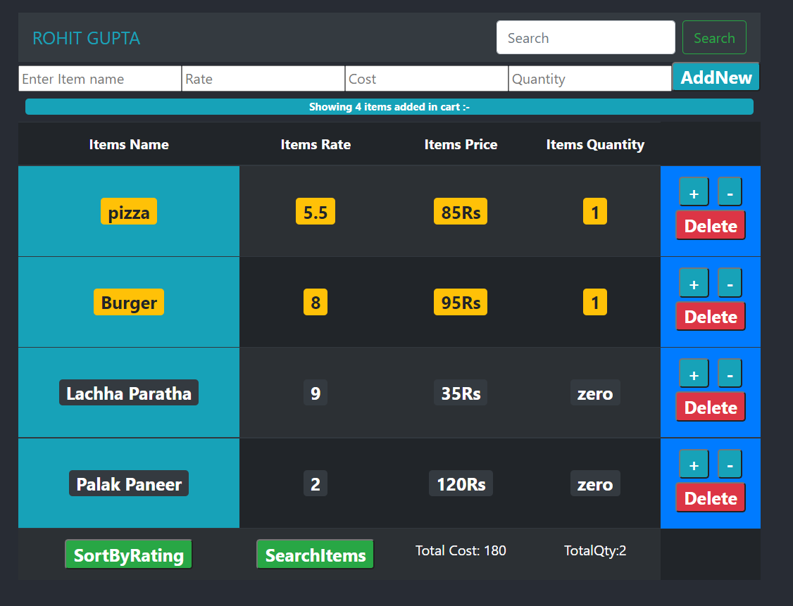

## Food Order Cart App -Created Using React Js

## Functionality
* Add Item (provide Item name, Item Price,item Rating and Item Quantity)
* Delete Items
* Increment & Decrement Quantity of Items
* Calculate Total Price And Total Quantity
* Sort Items By rating (pending)
* Search Any item in Cart (pending)
* Backend Node Js Api Is Working (will be integrated in project later on)

## Currently Working In Project -> EXPECT DEADLINE NOV 2022

## Tech Used
- React Js
- Node Js
  
Deployed In Heroku

## UI 
- HOME SCREEN

## Initial Demo Of Project ->https://food-order-cart-react.herokuapp.com/
  
## Future Scope
  
  
  

